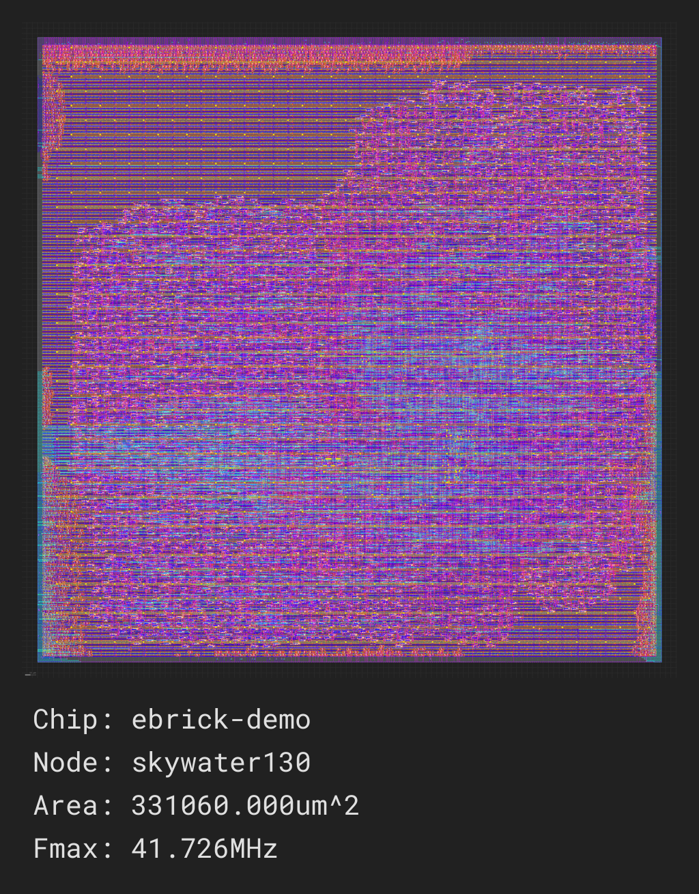

# ebrick-demo


EBRICKs are chiplets with a standardized interface that can be mixed and matched in Zero ASIC's SiP design ecosystem.  Systems can be constructed using standard EBRICKs from Zero ASIC's catalog, along with EBRICKs containing custom hardware designs.  This enables cost- and time-efficient development of high-performance hardware products by minimizing the need for custom silicon.

In this repository, we show how to create a custom EBRICK based around the open-source [PicoRV32](https://github.com/YosysHQ/picorv32) processor.  We demonstrate that our tools [switchboard](https://github.com/zeroasiccorp/switchboard) and [SiliconCompiler](https://github.com/siliconcompiler/siliconcompiler) make it easy to verify a custom EBRICK design and generate a physical implementation.  The intent is that this repository may be used as a template for building custom EBRICKs, where the demo logic (PicoRV32 core) is replaced with a user's custom logic.

The general design flow is:
1. Instantiate your custom logic in [ebrick_demo/rtl/ebrick_core.v](ebrick_demo/rtl/ebrick_core.v).
2. Edit switchboard-based tests and run `./ebrick_demo/ebrick.py -test <test-name>` to check the design's functionality.
3. Run `./ebrick_demo/ebrick.py -flow asicflow -target <process-name>` to generate a GDS with SiliconCompiler.

## Installation

There are two ways to run this demo: in a Docker container that provides all required tools (Verilator, OpenROAD, RISC-V tools, etc.), or directly on a machine where the required tools have been installed.  We recommend using Docker, since some of the tools take a long time to build.

### Method 1: Using Docker (recommended)

First, install Docker if you haven't already.  Here are the instructions for various platforms:
* [Linux Docker installation](https://docs.docker.com/desktop/install/linux-install/)
* [macOS Docker installation](https://docs.docker.com/desktop/install/mac-install/)
* [Windows Docker installation](https://docs.docker.com/desktop/install/windows-install/)

Once Docker is installed, launch the Docker Desktop application.

Then launch a terminal:
* Ubuntu: `Ctrl`-`Alt`-`T` or run the Terminal application from the Dash
* macOS: `Cmd-Space` to open Spotlight, then type `Terminal` and press `Enter`
* Windows: Open `Windows PowerShell` from the Start menu.

Once in the terminal, start a Docker container from our `ebrick-demo` image.  The `-v` part of the command makes the `sc_work` folder in the container visible outside of the container.  This will be useful later on if you want to view waveforms from simulations or the results of physical implementation runs.

```console
docker run -it -v "${PWD}/sc_work:/sc_work" ghcr.io/zeroasiccorp/ebrick-demo:latest
```

#### Installing the ebrick_demo Python package

You'll be presented with a terminal running in the Docker container.  From that terminal, clone the ebrick-demo repository:

```console
git clone https://github.com/zeroasiccorp/ebrick-demo.git
```

`cd` into it:

```console
cd ebrick-demo
```

Make sure that `pip` is up to date:

```console
python3 -m pip install --upgrade pip
```

Then install the `ebrick_demo` Python package with `pip`:

```console
pip3 install --ignore-installed -e .
```

To check that the package installation worked, try running `./ebrick_demo/ebrick.py -h`.  You should see a list of command-line options for the script.

**Stay in the Docker container to run the verification and ASIC build flows described below.**

Note: if you are using this repository as a template, you can create an image with project-specific tools by modifying and rebuilding [Dockerfile](Dockerfile).

### Method 2: Installing Tools Directly

The demos in this repository require the tools listed below.  If you don't plan to run physical implementation, the only required tools are Python, Verilator, and RISC-V GCC.
* [Python](https://www.python.org/downloads/)
* [Verilator](https://verilator.org/guide/latest/install.html)
* [RISC-V GCC](https://github.com/riscv-collab/riscv-gnu-toolchain)
* [Surelog](https://github.com/chipsalliance/Surelog/blob/master/INSTALL.md)
* [yosys](https://github.com/YosysHQ/yosys?tab=readme-ov-file#installation)
* [OpenROAD](https://github.com/The-OpenROAD-Project/OpenROAD/blob/master/docs/user/Build.md)
* [kLayout](https://www.klayout.de/build.html)

Each link points to the official installation instructions for that tool.

#### SiliconCompiler install scripts

If you are running Ubuntu, you may find it convenient to install tools via SiliconCompiler's install scripts, which take care of fetching build dependencies and configuring builds.  To use these scripts, first clone the SiliconCompiler repository:

```console
git clone https://github.com/siliconcompiler/siliconcompiler.git
```

`cd` into `siliconcompiler/setup`:

```console
cd siliconcompiler/setup
```

Then run the install scripts for the tools you need:
* Verilator: `./install-verilator.sh`
* Surelog: `./install-surelog.sh`
* yosys: `./install-yosys.sh`
* OpenROAD: `./install-openroad.sh`
* kLayout: `./install-klayout.sh`
* RISC-V GCC: no SC install script; use [official installation instructions](https://github.com/riscv-collab/riscv-gnu-toolchain)

`cd` back to the original directory when finished:

```console
cd -
```

#### Installing the ebrick_demo Python package

Once the required tools are installed, open a terminal and clone the `ebrick-demo` repository:

```console
git clone https://github.com/zeroasiccorp/ebrick-demo.git
```

`cd` into it:

```console
cd ebrick-demo
```

Make sure that `pip` is up to date:

```console
python3 -m pip install --upgrade pip
```

Then install the `ebrick_demo` Python package with `pip`:

```console
pip3 install --ignore-installed -e .
```

To check that the package installation worked, try running `./ebrick_demo/ebrick.py -h`.  You should see a list of command-line options for the script.

## Verification

To demonstrate how our tools can be used to verify EBRICK designs, this repository includes a test setup where the PicoRV32 EBRICK is simulated with Verilator, while the test stimulus (including processor memory) runs in Python using [switchboard](https://github.com/zeroasiccorp/switchboard).  We only briefly describe switchboard here, but for a more in-depth discussion, please see our [switchboard tutorial](https://github.com/zeroasiccorp/switchboard/tree/main/examples/umiram).

On the Verilog side of the test setup, the custom `ebrick_core` module is instantiated in [testbench.sv](ebrick_demo/testbench/testbench_prv32.sv).  Its [UMI](https://github.com/zeroasiccorp/umi) ports are connected to the switchboard modules `umi_to_queue_sim` and `queue_to_umi_sim`, which convey UMI transactions to/from shared memory queues.  On the Python side ([test_prv32.py](ebrick_demo/testbench/test_prv32.py)), a `UmiTxRx` object sends UMI packets to and receives UMI packets from these shared memory queues.  A processing loop in Python inspects incoming packets and forwards memory transactions to an instance of `UmiRam`, a software model of UMI memory.


Type `./ebrick_demo/ebrick.py -test` to run the hello world test.  The command compiles a RISC-V program, builds a simulator for the PicoRV32 EBRICK, and simulates the RISC-V program running on the EBRICK.  You should see output similar to:

```text
*** Creating switchboard queues ***
*** Launching RTL simulation ***
*** Assert ebrick "nreset" ***
*** De-assert ebrick "nreset" ***
*** Programming RAM ***
*** Assert ebrick "go" ***
*** Monitoring ebrick output ***
Hello World!
```

Waveforms can be probed by running `./ebrick_demo/ebrick.py -test -trace`, which generates a file called `testbench.vcd` that may be viewed with [GTKWave](https://gtkwave.sourceforge.net).  If you're using a Docker container to run the demo, the VCD file can be found in the native OS file system at `<docker-launch-dir>/sc_work/ebrick-demo/testbench.vcd`.  Note that GTKWave should be run outside of a Docker container because it is a graphical application.

When debugging EBRICK designs, a good starting point is to look at the [UMI](https://github.com/zeroasiccorp/umi) ports on the `ebrick_core` interface, since they convey the interactions between custom logic in the core and the outside world.  You can find these signals in GTKWave by expanding `TOP → testbench → core2mtr_i → ebrick_core_`, then apply the filter `uhost_` or `udev_`.  `uhost_req_` ports convey requests from the core logic to the outside world, and `uhost_resp_` ports convey the responses.  Similarly, `udev_req_` ports convey requests from the outside world to the core logic, and `udev_resp_` ports convey the core's responses.

In this demo, there are four `uhost_` request/response ports and four `udev_` request/response ports.  However, most are unused; only one `uhost_` request/response pair is active, corresponding to reads/writes issued by the RISC-V processor to memory outside of the EBRICK.  If you view the signals `uhost_req_valid[0]`, `uhost_req_ready[0]`, `uhost_resp_valid[0]`, and `uhost_resp_ready[0]`, you can get a sense for the flow of requests and responses:
* `uhost_req_valid[0]` is asserted, indicating that the processor is sending a read/write request to memory.
* `uhost_req_ready[0]` is asserted, acknowledging the request per the [UMI handshake protocol](https://github.com/zeroasiccorp/umi?tab=readme-ov-file#42-handshake-protocol)
* Some time later, `uhost_resp_valid[0]` is asserted, indicating a response from memory.
* `uhost_resp_ready[0]` is asserted by the processor, acknowledging the response.


## Physical implementation

The EBRICK physical flow is in [ebrick_demo/ebrick.py](ebrick_demo/ebrick.py).
It uses SiliconCompiler to build a GDS from the design using the [asicflow](https://docs.siliconcompiler.com/en/latest/reference_manual/predef_modules/flows.html#asicflow-ref).

### Flow

The flow will use [ASAP7](https://docs.siliconcompiler.com/en/latest/reference_manual/predef_modules/pdks.html#asap7-ref) as the base process to build the design.

To execute the flow, run the following command:

```console
./ebrick_demo/ebrick.py -flow asicflow
```

This build will use the following open-source tools to generate a GDS:

* [Surelog](https://docs.siliconcompiler.com/en/latest/reference_manual/predef_modules/tools.html#surelog-ref)
* [yosys](https://docs.siliconcompiler.com/en/latest/reference_manual/predef_modules/tools.html#yosys-ref)
* [OpenROAD](https://docs.siliconcompiler.com/en/latest/reference_manual/predef_modules/tools.html#openroad-ref)
* [kLayout](https://docs.siliconcompiler.com/en/latest/reference_manual/predef_modules/tools.html#klayout-ref)

The full flow is shown below:


### Results

At the end of the run you can inspect the results in the `build/` directory or view the summary image at `build/ebrick-demo/job0/ebrick-demo.png`.


### Switching targets

You can also run the EBRICK on [Skywater 130](https://docs.siliconcompiler.com/en/latest/reference_manual/predef_modules/pdks.html#skywater130-ref).
To do so, simply add `-target skywater130_demo` to the command:

```console
./ebrick_demo/ebrick.py -flow asicflow -target skywater130_demo
```

At the end of the run you should have an image like this:



## File structure

Custom logic is implemented in the [ebrick_core](ebrick_demo/rtl/ebrick_core.v) module definition.  The `ebrick_core` interface is standardized and must not be changed; this is effectively the contract for creating a chiplet that can plug into our ecosystem.  When we run implementation at the top level (not part of this demo), a user's `ebrick_core` module is instantiated within a standard `ebrick` wrapper that bridges the `ebrick_core` interface to external pads.

It's not necessary to implement all module definitions in `ebrick_core.v`; if some modules are defined in other files, those files are specified in `setup_core_design` in [ebrick_demo/ebrick.py](ebrick_demo/ebrick.py) using SiliconCompiler.  For example, the demo design specifies `picorv32.v` as an additional input file.
